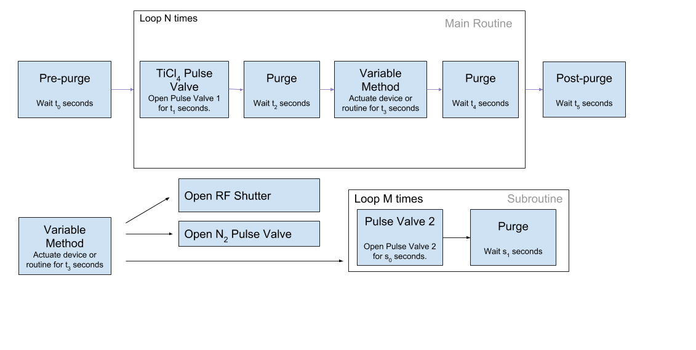
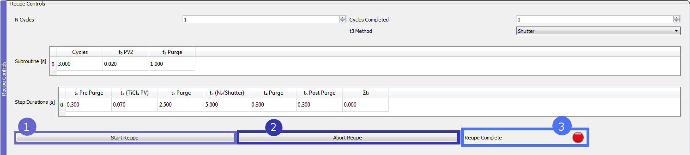

# ALD Quickstart Guide

## User Interface Basics

The user interface (aside from the sidebar) is completely comprised of removable dockWidget panels. To pop any of these widgets out of the mdiArea 

## ALD Recipe

####Recipe Controls

**Diagram 1:** Flow chart describing the ALD recipe.

1. Main routine time table. User can enter values into this table representing durations of steps performed in the sequence described by *Diagram 1.* If PV/Purge option is selected in t3 dropdown menu, subroutine time table is accounted for in main routine time table.

2. *"t3 method"* dropdown menu offers a set of different operations to be performed during the Variable Method step shown in the main routine in *Diagram 1.*

3. *Subroutine* time table. This time table is run in place of "t3 (N2/Shutter)" when "PV/Purge" is selected. When this is the case, the subroutine table is summed and its total time elapsed is factored into the main routine time table.

The *N cycles* field will determine the number of times the main routine loop is repeated.

Possible choices for the Variable Method are shown in the bottom half of Diagram 1. and are listed here:

* Open RF Shutter (Shutter)
* Open N2 Pulse Valve (N2)
* Subroutine repeated M times. (PV/Purge)

1. *Start Recipe*. This push button is functionally equivalent to right-clicking the ALD Recipe measurement routine on the program's sidebar and selecting *Start*. Starts the routine according to parameters specified in the *Recipe Controls* panel. 
2. *Abort Recipe*. This push button is functionally equivalent to right-clicking the ALD Recipe measurement routine on the program's sidebar and selecting *Interrupt*. Halts the recipe in place irrespective of the routine's progress.
3. *Recipe Complete* indicator. Lights green when full recipe instruction set has been carried out by the recipe measurement routine.

## ALD Display Measurement Module

This module is set to automatically start upon initializing the program. This module is responsible for generating the user interface and then updating any live plots in the user interface thereafter. 

The measurement module, while running also checks for whether any of the prerequisite environmental conditions are met.

These panels contain pyqtgraph plots provide the user with a visual time history of sensor quantities over time.
This plotting function also relies on the ALD_Display measurement module to be running.